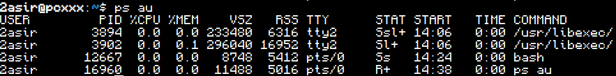
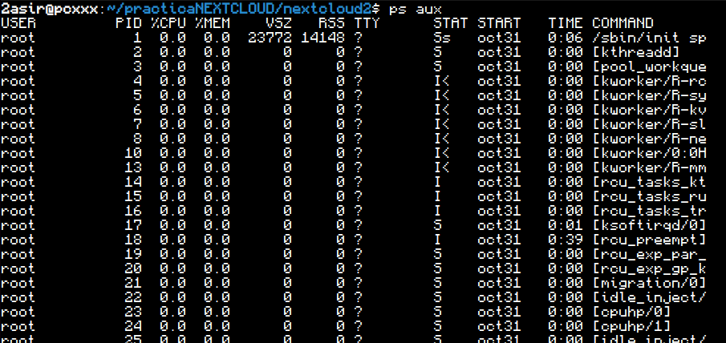
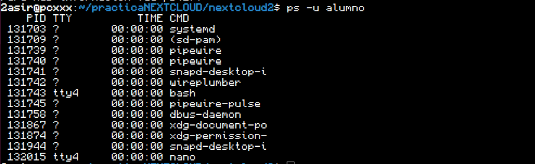
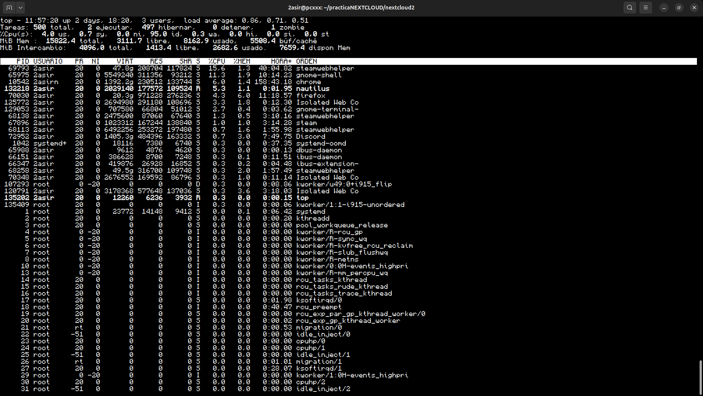
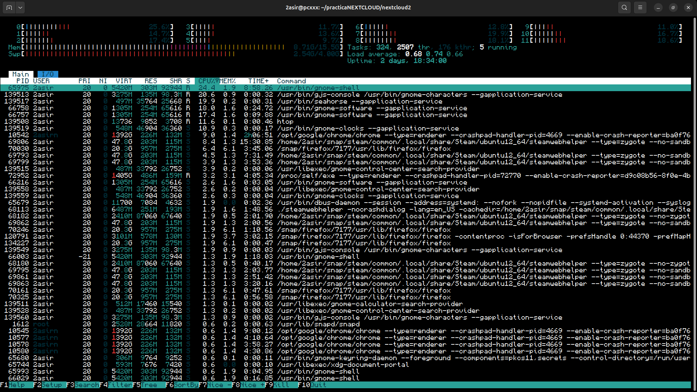
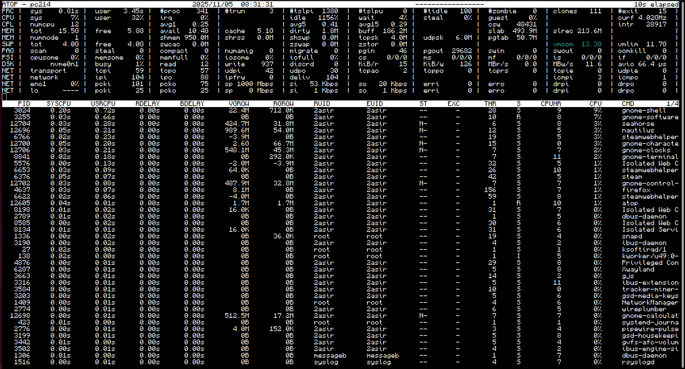
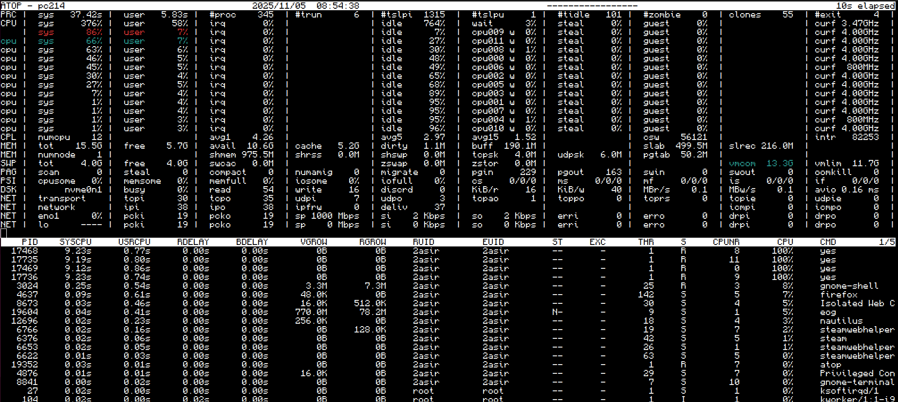

# Procesos
#### En este documento hablaremos sobre los diversos comandos que podemos usar frente a la monitorizacion de tareas y usuarios
---
# PS
Comandos de ps y sus opciones


```
ps au
```
Presenta una lista de los procesos que se estan ejecutando en el momento en el que se escribe el comando. Incluyendo el usuario y el PID.



---


```
ps aux
```
Como el anterior pero incluyendo todos los procesos ejecutandose en el sistema.


---


```
ps -u 'usuario'
```
Muestra todos los procesos ejecutados por un usuario concreto.




# TOP
Comandos de top y sus opciones


```
top
```
Muestra los procesos ejecutandose a tiempo real





```
top -b -n 3 > top.info
```

Este comando hace una captura de lo que se mostraria en el comando top (procesos en tiempo real) y los introduce en un archivo, en el caso del ejemplo, en top.info


# HTOP
Comandos de htop y sus opciones


```
htop
```
Es parecido al comando top, vendria a ser equivalente al administrador de tareas en windows, permitiendo interactuar y realizar acciones con los procesos, por ejemplo, cerrarlas sin necesidad de usar un comando aparte.





# ATOP
Comandos de atop y sus opciones


```
atop
```
Este servicio toma instantaneas de los procesos en ejecucion cada cierto tiempo. Por defecto las hace cada 10 minutos.



Para acceder al comando "raw" de un dia en concreto debes acceder a /var/log/atop/ y ejecutar el comando 
```
cd /var/log/atop
atop -r atop_XXXXX
```

Podemos "estresar" la cpu con atop forzandola a crear instantaneas:

```
for i in {1..2}; do yes >/dev/null & done
atop
```




