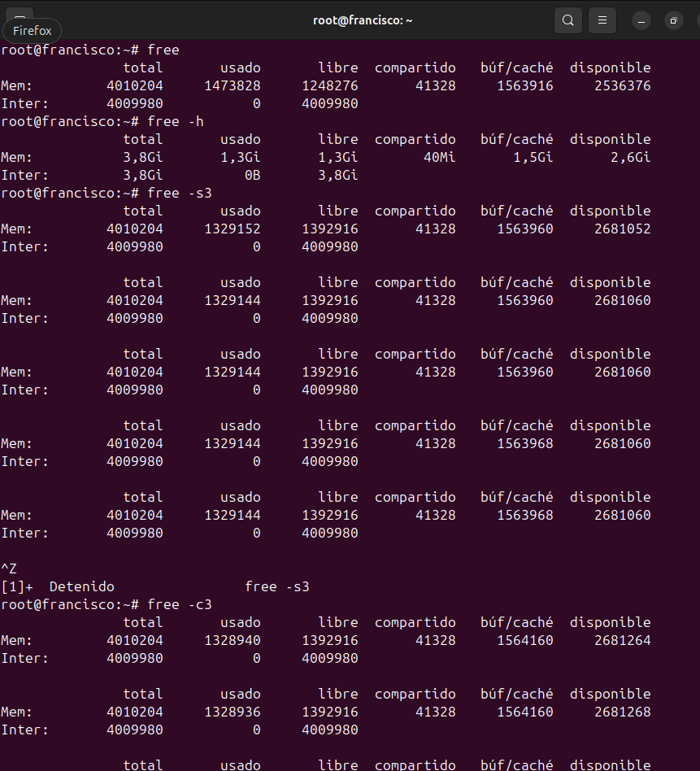
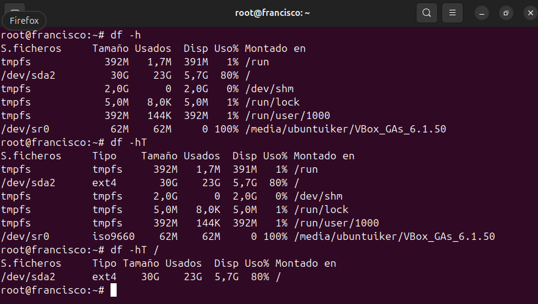
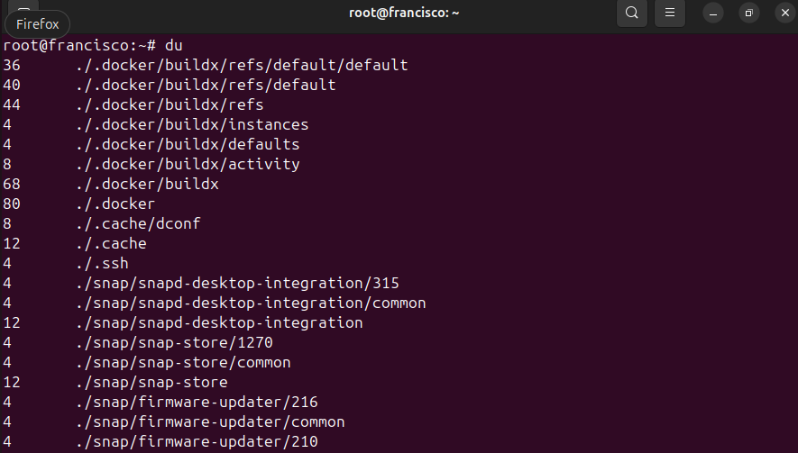

# Memoria, espacio y tal
#### En este documento hablaremos sobre los diversos comandos que podemos usar a la hora de monitorizar la memoria y el espacio en un dispositivo linux
---

## FREE

```
Free       #Muestra los atributos basicos, en bruto, de la memoria
```
```
free -h    #Muestra la memoria usada y libre en unidades legibles.
```
```
free -sX   #Monitoriza la memoria de forma continua, refrescando los datos cada X segundos
```
```
free -cX   #Ejecuta la consulta de memoria X veces.
```


## DF

```
df -h       #Muestra el espacio en disco total, usado y disponible en unidades leibles por el humano.
```
```
df -ht      #Igual al anterior, pero ademas muestra el sistema de archivos.
```



## DU

 Muestra el resumen total del tamaño ocupado por el directorio.

```
DU 
```


