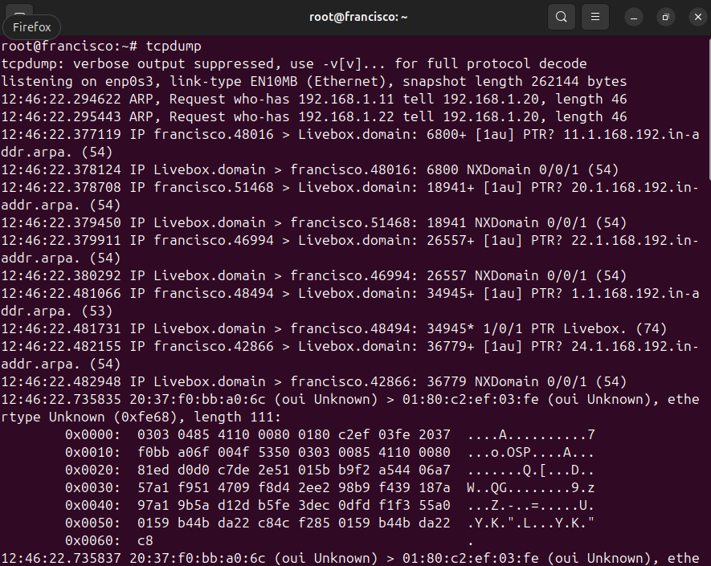
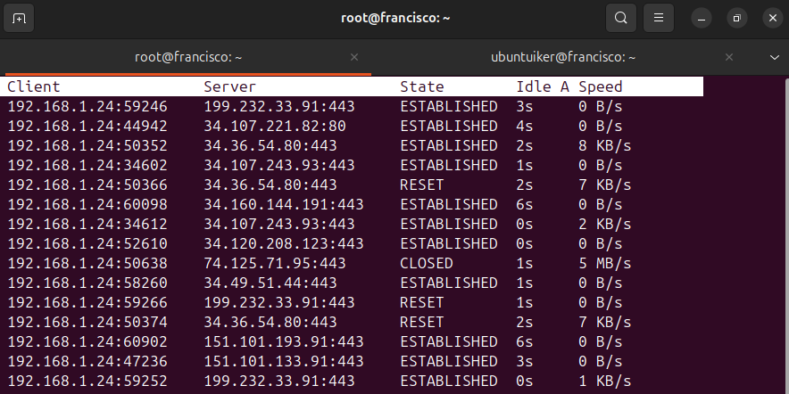
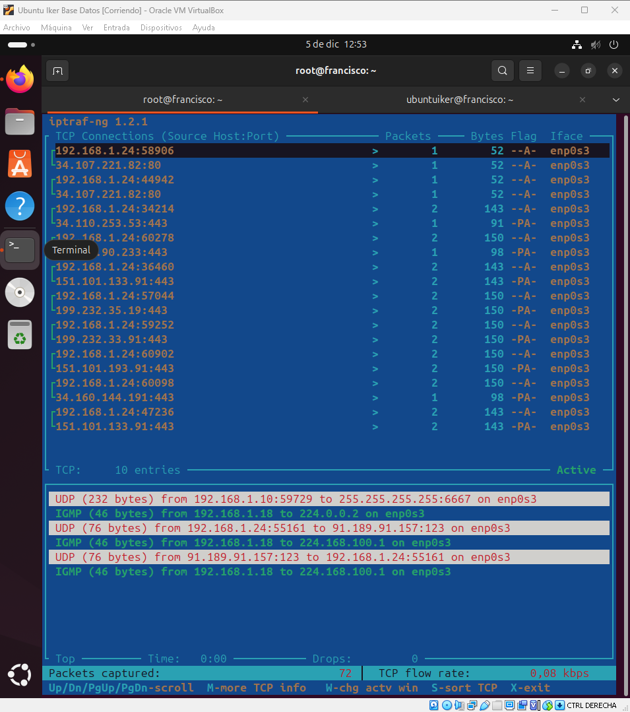
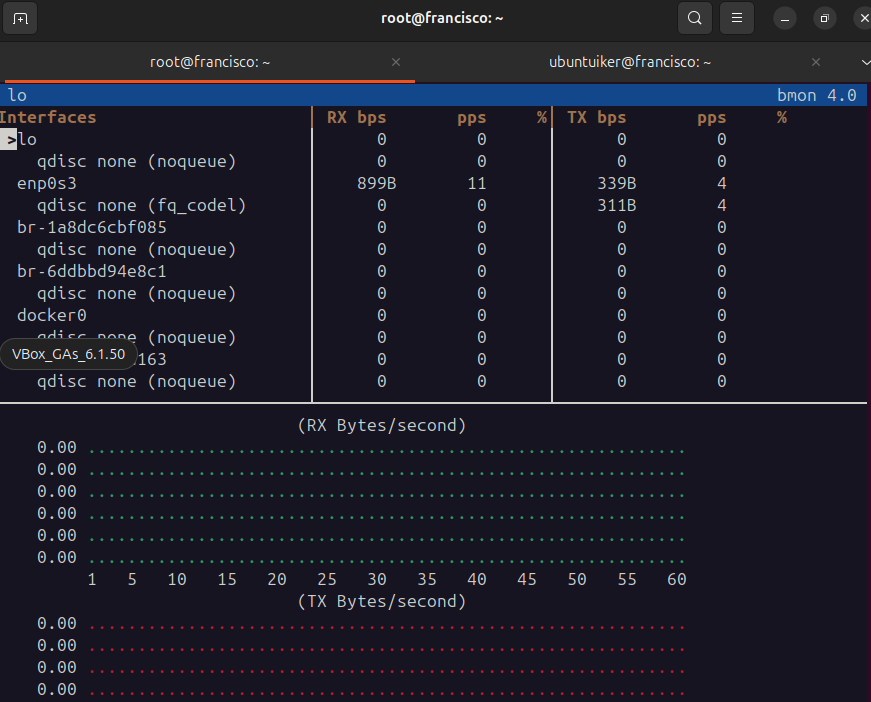

# Trafico de la red
#### En este documento hablaremos sobre los diversos comandos que podemos usar a la hora de monitorizar el trafico de la red en linux
---

## TCPDUMP

```
tcpdump        #Captura los paquetes y vuelca el trafico de red para analizarlo.
```



## TCPTRACK

```
tcptrack -i tarjeta de red        #Monitoriza a tiempo real las conexiones tcp, de manera detallada.
```



## IPTRAF

```
iptraf      # Genera un menú con estadisticas detalladas de trafico ip, udp y tcp por puertos.
```


## BMON

```
bmon      #Monitoriza el ancho de banda y visualiza el trafico con graficos.
```


