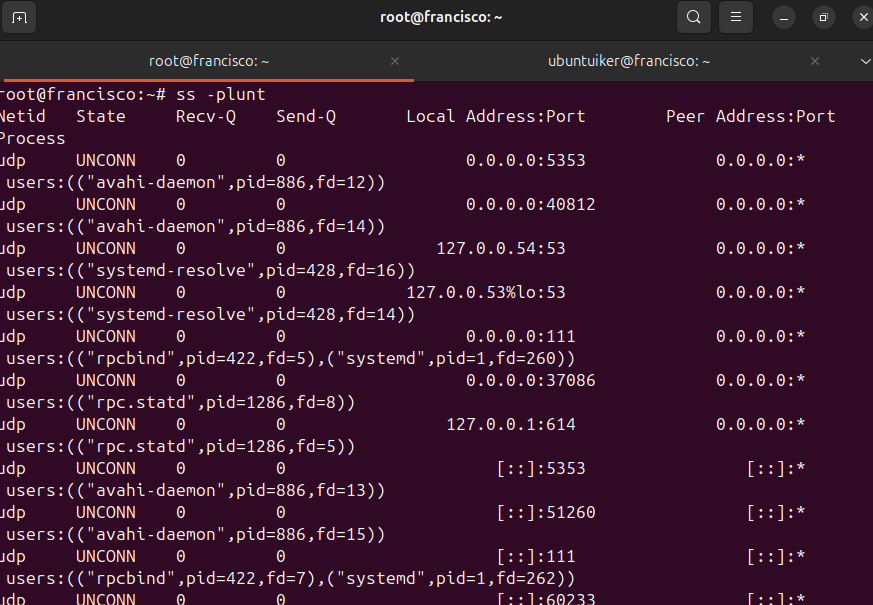
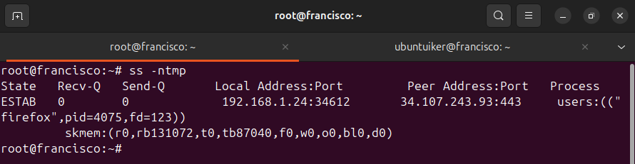
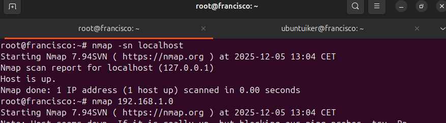
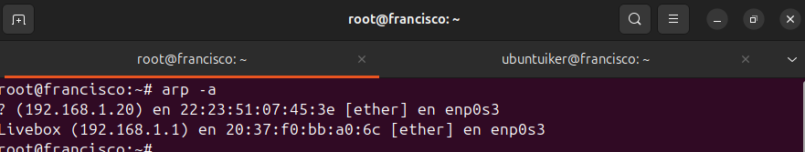
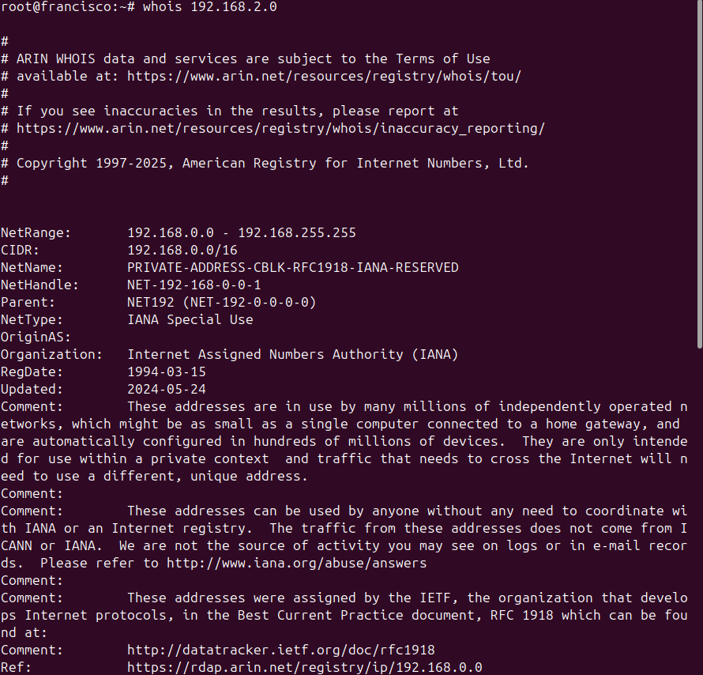

# Puertos
#### En este documento hablaremos sobre los diversos comandos que podemos usar a la hora de monitorizar los puertos en un dispositivo linux
---

## SS

```
ss -plunt       #Muestra todos los puertos tcp y udp que estan escuchando.
```
```
ss -ntmp    # Lista de conexiones tcp con sus puertos y los procesos correspondientes.
```




## NMAP

```
nmap -sn ip      # Realiza un ping para verificar si el host de la ip esta activo.
```
```
nmap direccion de red    #Descubre todos los equipos activos de una red.
```



## ARP

```
arp -a     #Muestra la tabla arp actual del sistema.
```



## WHOIS

```
whois ip     #Consulta las bases de datos de los registros regionales para revelar datos del objetivo.
```


